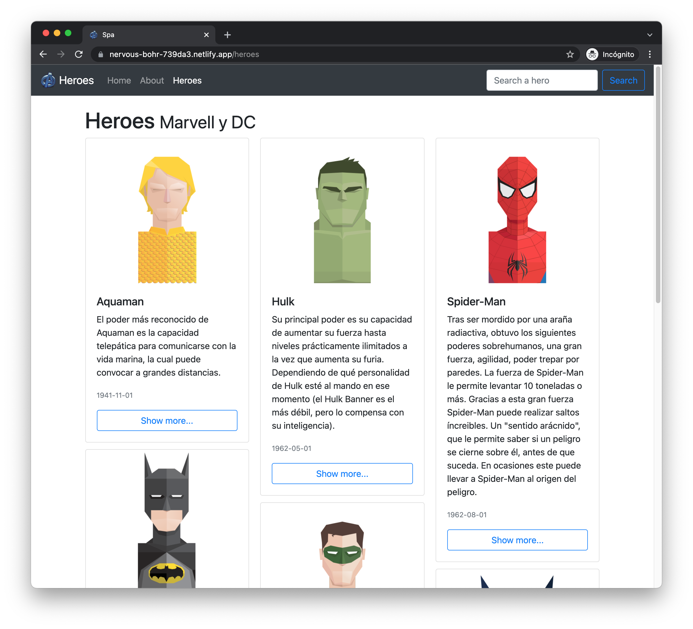
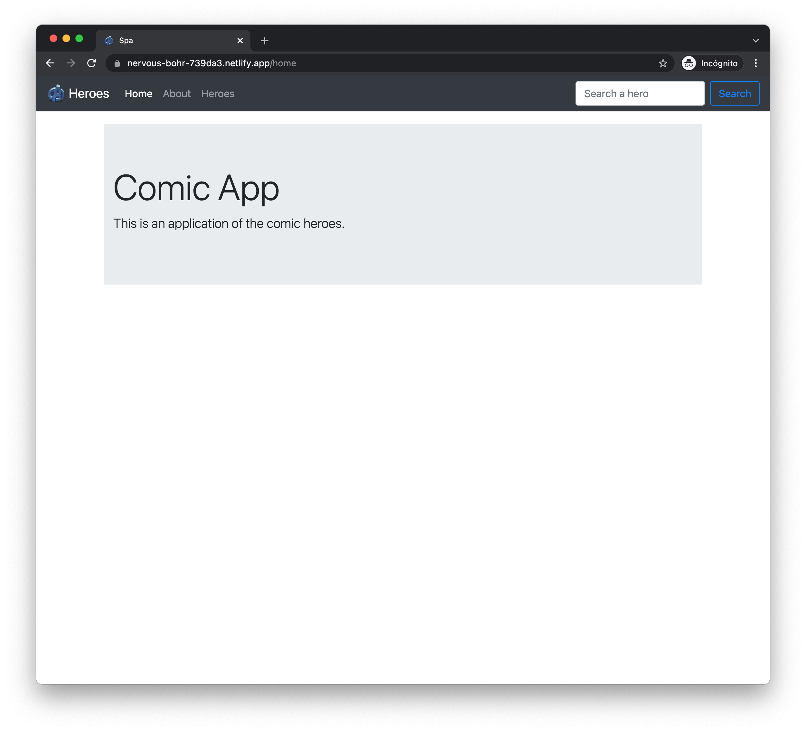
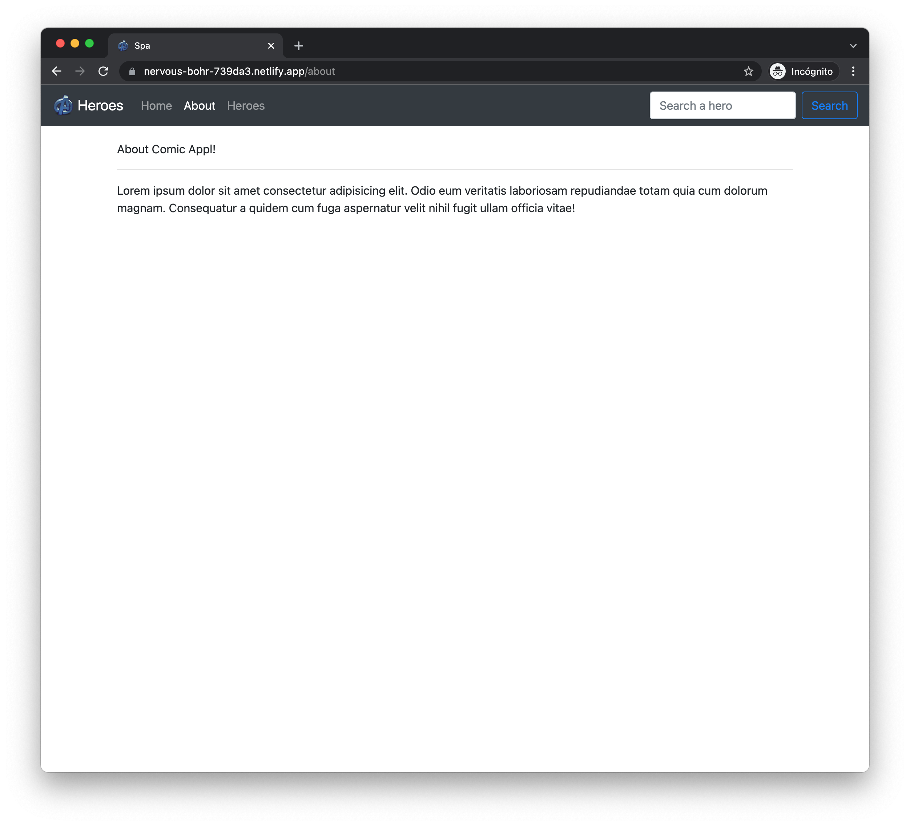
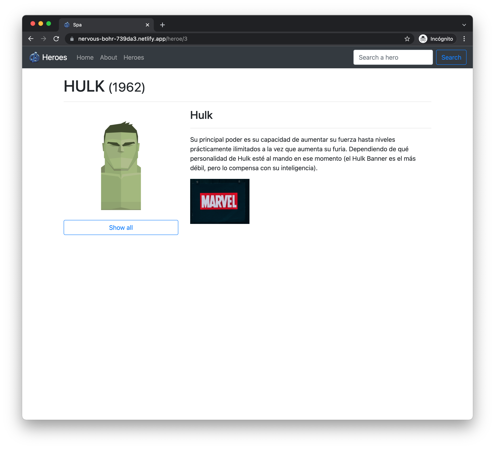

# Spa - Comics app - Heroes

The project was published on Netlify, you can watch its live demo here https://nervous-bohr-739da3.netlify.com/

This project was generated with [Angular CLI](https://github.com/angular/angular-cli) version 8.3.20.

