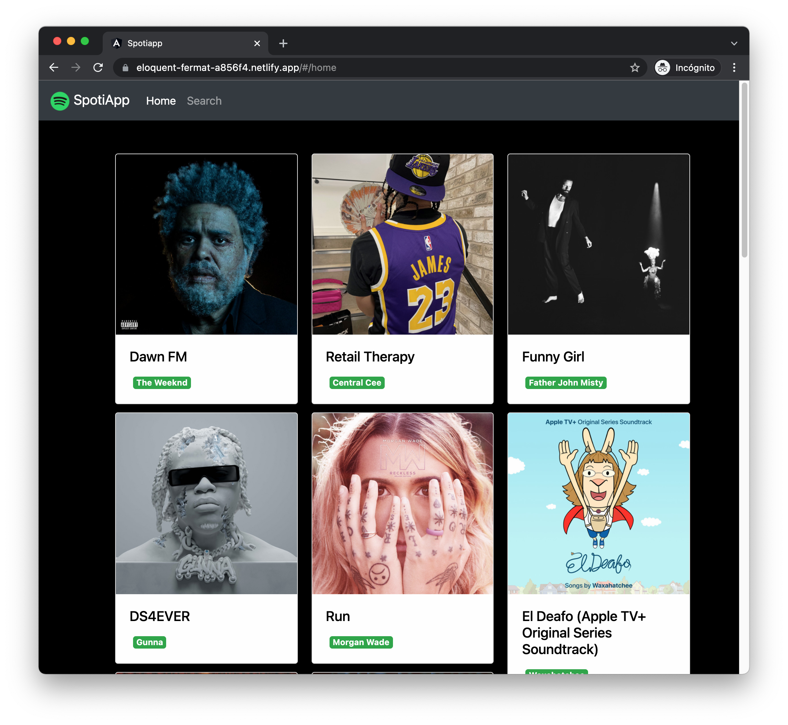
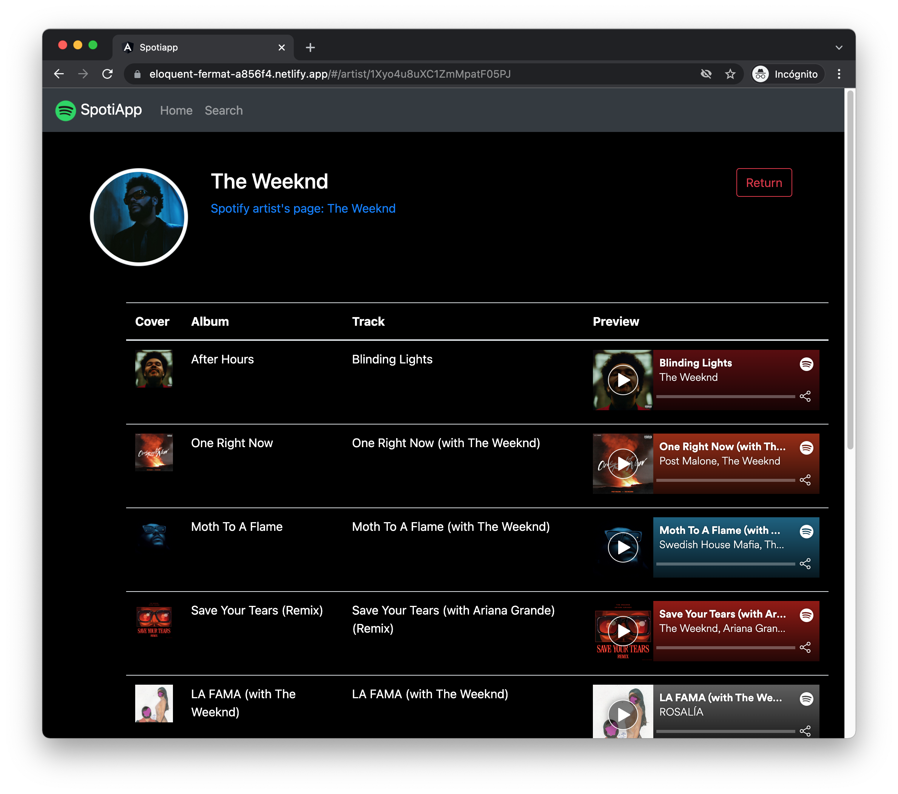
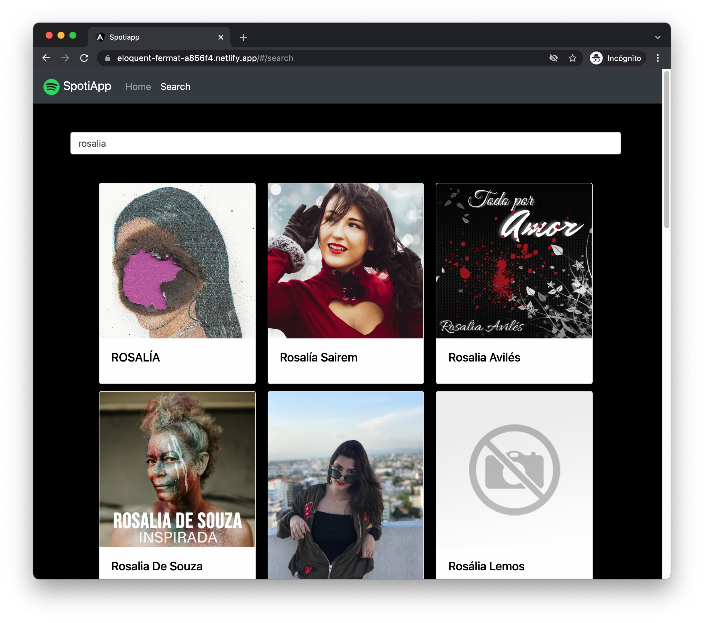

# SpotiApp

Demo Page [https://eloquent-fermat-a856f4.netlify.app/](https://eloquent-fermat-a856f4.netlify.app/)

For usage of Spotify Web Api firstly uou should get the api access token, take a look here https://developer.spotify.com/documentation/general/guides/authorization/client-credentials/

In this project is using the lightweight JS server (built on Express and deployed on Heroku) from here https://github.com/Klerith/spotify-get-token

## Screenshots:

